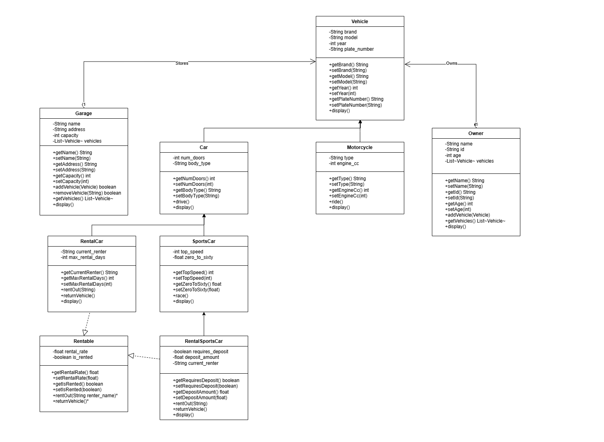
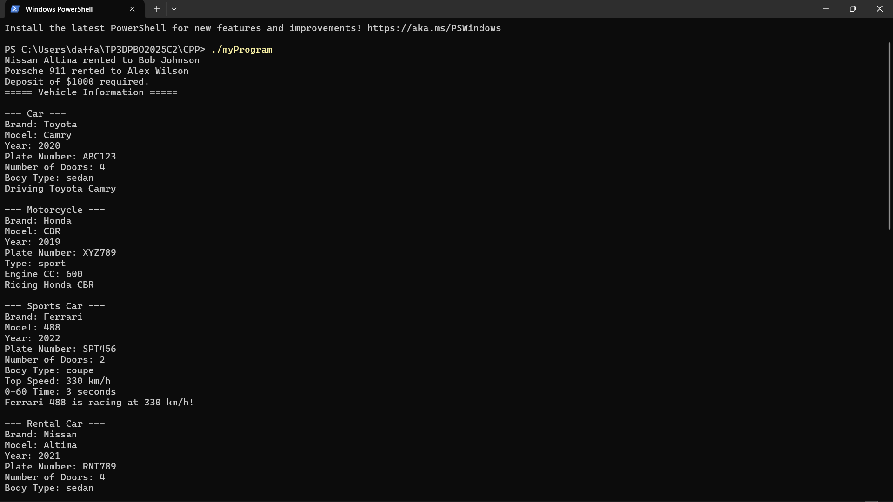

# TP3DPBO2025C2

## Janji

Saya Daffan Alfauzi Nurrobby dengan NIM 2007591 mengerjakan Tugas Praktikum 3 dalam mata kuliah Desain Pemrograman Berorientasi Objek untuk keberkahanNya maka saya tidak melakukan kecurangan seperti yang telah dispesifikasikan. Aamiin.

## Desain Program

Program ini merupakan sistem manajemen kendaraan sederhana yang mengimplementasikan konsep OOP dengan fokus pada:

1. **Inheritance (Pewarisan)**
   - `Vehicle` sebagai kelas dasar
   - `Car` dan `Motorcycle` mewarisi dari `Vehicle`
   - `SportsCar` mewarisi dari `Car`

2. **Hierarchical Inheritance**
   - Struktur bertingkat: `Vehicle` → `Car` → `SportsCar`

3. **Multiple Inheritance**
   - `RentalCar` mewarisi dari `Car` dan mengimplementasikan interface `Rentable`
   - Menggabungkan properti kendaraan dengan kemampuan untuk disewakan

4. **Hybrid Inheritance**
   - `RentalSportsCar` mewarisi dari `SportsCar` dan mengimplementasikan interface `Rentable`
   - Menggabungkan hierarchical dan multiple inheritance

5. **Composition (Komposisi)**
   - `Owner` memiliki kumpulan objek `Vehicle` (hubungan "has-a")
   - Menggunakan metode `addVehicle()` untuk membentuk komposisi

6. **Array of Objects**
   - `Garage` memiliki array/collection dari objek `Vehicle`
   - Menggunakan vector di C++, ArrayList di Java, dan list di Python

### Diagram Kelas

## Alur Program

1. Program membuat instance berbagai jenis kendaraan (`Car`, `Motorcycle`, `SportsCar`, dll)
2. Membuat objek `Owner` dan menambahkan kendaraan ke pemilik (demonstrasi komposisi)
3. Membuat objek `Garage` sebagai wadah untuk menyimpan kendaraan (array of objects)
4. Menguji fungsionalitas penyewaan kendaraan dengan kelas `RentalCar` dan `RentalSportsCar`
5. Menampilkan informasi untuk setiap objek untuk menunjukkan fungsi pewarisan yang berbeda

## Dokumentasi

### Screenshot Program

#### Output C++

## Fitur OOP yang Diimplementasikan

1. **Inheritance (Pewarisan)**:
   - `Car` dan `Motorcycle` mewarisi dari `Vehicle`
   - Memanfaatkan keyword `extends` di Java, `public class` di C++, dan sintaks Python

2. **Hierarchical Inheritance**:
   - Struktur bertingkat: `Vehicle` → `Car` → `SportsCar`
   - Menunjukkan bagaimana kelas dapat dispecialisasi bertingkat

3. **Multiple Inheritance**:
   - `RentalCar` menggabungkan `Car` dan `Rentable`
   - Implementasi dengan interface di Java, multiple inheritance di C++ dan Python

4. **Hybrid Inheritance**:
   - `RentalSportsCar` menggabungkan hierarchical dan multiple inheritance
   - Demonstrasi kelas yang mewarisi dari kelas spesialis dan interface

5. **Composition**:
   - `Owner` memiliki kendaraan
   - Menunjukkan hubungan "has-a" vs "is-a" (inheritance)

6. **Array of Objects**:
   - `Garage` mengelola kumpulan kendaraan
   - Implementasi dengan collection di ketiga bahasa